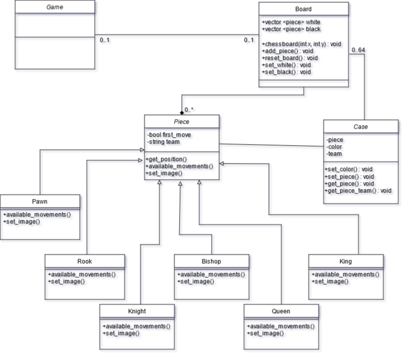

# Echecs

Ce projet à pour but de générer un jeu d'échecs, avec 2 modes de jeu, un contre un amis et un contre un ordinateur.

# Contre un ami

[TODO]

# Contre un ordinateur

[TODO]

# Choix de l'architecture du projet 

J'ai choisi de faire une classe par pièce pour plus de simplicité.  
Elles héritent toute de la classe Piece qui comprendras des informations sur les déplacements, le premier déplacement et autre.  
La classe principale sera la classe game, qui comprendra l'affichage du jeu, d'un menu de choix ( jouer contre un ami ou contre l'ordinateur)  

# Choix de langage et technologies

Pour ce projet, j'ai décidé d'utiliser le C++, car c'est un langage que je maîtrise assez bien et j'avais envie de progresser en C++.  
Comme je n'ai jamais fait d'interface graphique au paravant, ce projet me permets de découvrir plus en détail la programmation graphique dans ce langage.  
Enfin, pour la gestion graphique, j'ai choisi l'outil Qt, qui m'a été recommandé et que j'avais déjà pu expérimenté.  

# Sources

Je me suis inspiré de differentes sources pour ce jeu, d'abord : https://fr.jeffprod.com/blog/2014/comment-programmer-un-jeu-dechecs/  
J'ai repris la logique, que j'ai changé en une classe par pièce pour plus de simplicité (en effet certains mouvements sont identiques, mais je préfère différencier les pièces par une classe que par leurs déplacements.  
Les pièces viennent de ce [lien](https://www.cleanpng.com/png-chess-piece-knight-rook-clip-art-chess-pieces-585652/download-png.html) : 

