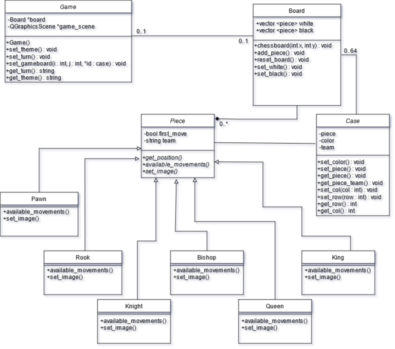

# Echecs

Ce code à pour but de générer un jeu d'échecs, avec 2 mode de jeu, un contre un amis et un contre un ordinateur.

# Contre un ami

[TODO]

# Contre un ordinateur

[TODO]

# Choix de l'architecture du projet 

# Sources

Je me suis inspiré de differentes sources pour ce jeu, d'abord : https://fr.jeffprod.com/blog/2014/comment-programmer-un-jeu-dechecs/

J'ai repris la logique, que j'ai changé en une classe par pièce pour plus de simplicité (en effet certains mouvements sont identiques, mais je préfère différencier les pièces par une classe que par leurs déplacements.

Les pièces viennent de cette image : 

